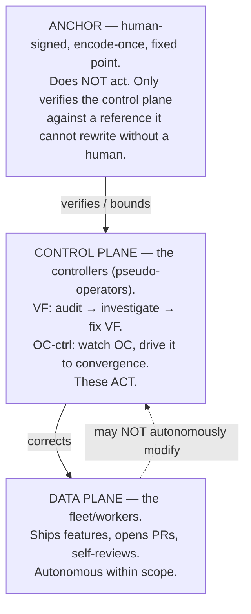

# Control Plane and Anchor

This note fixes the vocabulary for three things that are easy to conflate: the
**data plane** (the autonomous fleet that does the work), the **control plane**
(the supervisory "controllers" that watch a target and fix its drift), and the
**anchor** (the human-signed fixed point where the chain of correction
terminates). It exists because the supervisory responsibility is currently
bolted onto OperationsCenter itself, and we keep reaching for a mental picture —
"a supervisor that lives *above* OC" — that is subtly but importantly wrong.

The core claim: these are **not three layers stacked by altitude**. They are a
single **correction chain**, and the only architecturally interesting question
is *where the chain terminates*.

## Stop thinking "height," think "who corrects whom"

The intuitive picture is `worker → controller → super-controller`, each one
taller and smarter than the last. That picture is a trap (see
[The regress](#the-regress-why-the-anchor-cannot-be-a-controller)). The honest
picture is a chain of corrections that must bottom out somewhere a human signed.



The anchor is drawn at the **top** of the diagram only because it bounds
everything below it. Conceptually it is the **floor** — the irreducible base of
trust — not a ceiling of greater intelligence. That inversion is the whole point
of this document.

## The three roles

| Role | What it does | Corrected by | May touch |
| --- | --- | --- | --- |
| **Data plane** (fleet/workers) | Feature work: implement, test, open PR, self-review, merge on green. | The control plane. | Application/feature code, within policy scope. |
| **Control plane** (controllers) | *Acts.* Watches a target, detects drift/rot, applies fixes. Two instances today: VF (audit monitor) and OC-ctrl (drives OC toward convergence). | Nothing autonomous — see the anchor. | The data plane and its own target's operational state. |
| **Anchor** | *Does not act.* Verifies the control plane against a human-signed reference and catches rot in it. | A human, **once**, at encode time. | Nothing — it only reads and reconfirms. |

The two controllers are the same *kind* of thing — a monitor that runs
`audit → investigate → fix` against a target — instantiated twice (target = VF,
target = OC). That sameness is the argument for factoring them into one
component with two configurations rather than two bespoke watchers.

## The regress: why the anchor cannot be a controller

Every system that fixes itself hits the classic regress: the thing that fixes
`X` must itself be fixed by something. You cannot have infinite turtles.

If we model the anchor as "a smarter autonomous supervisor that fixes the
controllers," we have not terminated the stack — we have **added a turtle**. Now
*who fixes the super-supervisor?* The same question reappears one level up, and
no amount of additional intelligence answers it, because the problem is
structural, not a capability gap.

The chain terminates only at something that **does not act autonomously**, and
therefore needs no corrector of its own. That is the anchor:

- It performs exactly one operation: **verify the control plane against a
  human-signed reference** (the encode-once `[check: ref]` pattern — a human
  renders a judgment once; the anchor mechanically reconfirms it forever and
  flags rot).
- It is small, dumb, and rarely changes. These are *features*. An anchor can be
  load-bearing without its own corrector **precisely because** it is minimal and
  human-tied — there is almost nothing in it to drift, and what little there is
  cannot change without a human signature.

So the controllers are where the intelligence and the *action* live; the anchor
is where the *trust* bottoms out. Opposite ends of the chain, different jobs.

## We already observed the anchor surface empirically

This is not a purely theoretical boundary. When the fleet was asked to
autonomously implement its own self-healing improvements (changes to its
executor / claim / policy / reviewer machinery), its own policy refused:

```
category=policy_blocked
reason=execution requires review before autonomous execution: violations: review.required
status=require_review
```

Feature work in the data plane (e.g. `observer/` changes) was classified
`autonomous` and merged hands-off. Changes to the control/governance machinery
were classified `require_review`. **That line is the anchor surface, revealed by
the system itself** — the data plane is permitted to self-govern feature work,
but self-modification of the control plane requires the human-signed anchor. We
did not design that moment; the policy gate exposed where the floor already is.

This is the practical statement of the
[self-healing invariant](../../README.md): the system always judges and corrects
itself with **no human in the per-correction loop**, and a human appears **only
at the encode-once anchored root**.

## What to formalize (and what not to)

Two distinct moves, easily conflated:

1. **Lift the control plane out of OC.** Today OC is both the worker *and* its
   own corrector — a conflict of interest, and the exact thing that made the
   policy gate fire. Factor the supervisory responsibility into **one reusable
   control-plane component with two instances** (target = VF, target = OC),
   running the shared `audit → investigate → fix` loop. This is the real "new
   repo/component" the topology discussion keeps circling. It is an *engineering
   artifact* — a service you stand up.

2. **The anchor is a discipline, not a service.** Do **not** build "a bigger
   brain above OC." The anchor is the set of human-signed references plus the
   mechanical reconfirmation that the control plane cannot rewrite without a
   human. Today **the human is the anchor** — every re-auth, every signed
   `reviewer-verdict` status, every explicit "yes, proceed." Formalizing the
   anchor means **shrinking** the human's role to the smallest possible
   encode-once surface and mechanizing the reconfirmation around it — not adding
   a taller autonomous layer.

### The encode-once anchor surface

The anchor is whatever a human must sign that the control plane cannot forge.
Concretely, today this includes:

- **Credential / identity** the fleet cannot self-refresh (the read-only
  credential bind is an anchor, not a bug: the data plane cannot mint its own
  trust).
- **Signed verdicts** — e.g. the `reviewer-verdict` status a human posts, and
  the merge authority gated on it.
- **Policy review-required boundaries** — the path/scope rules that force
  control-plane changes through human review.
- **`[check: ref]` references** — a human judgment encoded once, mechanically
  reconfirmed thereafter, with staleness flagged.

Formalization work is mostly *narrowing* this set to the minimum and making each
item explicit and reconfirmable — not expanding it.

## Open questions

- **Where does the control-plane component live?** Its own repo, or a component
  inside an existing host? It must sit *outside* the data plane it corrects.
- **How does the anchor flag control-plane rot** without itself becoming an
  actor that needs correcting? (Verification-only, never mutation, is the
  invariant to preserve.)
- **Self-heal tasks** that touch control-plane machinery belong to this
  component under human review — not to the autonomous data-plane queue, where
  the policy gate correctly blocks them.

## Summary

- **Data plane** — does the work; corrected by the control plane; autonomous
  in-scope.
- **Control plane** (two controller instances) — *acts*; watches a target and
  fixes its drift; the intelligent part. Factor into one component, two configs.
- **Anchor** — *does not act*; verifies the control plane against a human-signed
  fixed reference; the floor where the regress stops. A discipline, not a
  service; shrink it, do not grow it.

The thing that feels like "a supervisor above OC" is real — but it is the
**floor of the control plane, not a ceiling above it**.
