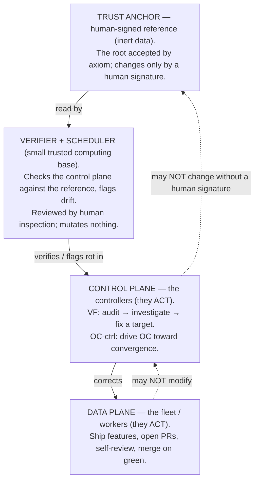

# Control Plane and Anchor

This note fixes the vocabulary for three things that are easy to conflate: the
**data plane** (the autonomous fleet that does the work), the **control plane**
(the supervisory "controllers" that watch a target and correct its drift), and
the **anchor** (the human-signed fixed point the whole structure is verified
*against*). It exists because the supervisory responsibility is currently bolted
onto OperationsCenter itself, and we keep reaching for a mental picture — "a
supervisor that lives *above* OC" — that is subtly but importantly wrong.

> **Terminology warning — two unrelated meanings of "anchor."** Elsewhere in
> this ecosystem "anchor" means **session anchoring**: a working-repo session
> binds its `.context/` state to its owning manifest via ContextLifecycle
> (`cl session start` → `CL_ANCHOR`; see
> [cognition-memory-overview.md](cognition-memory-overview.md) §1 and
> [contextlifecycle-anchoring.md](contextlifecycle-anchoring.md)). That is a
> *state-binding mechanism*. The **anchor in this document** is a *trust root*
> — the PKI sense of a **trust anchor**: a reference accepted by axiom because a
> human provisioned it, not because anything above it vouched for it. Same word,
> unrelated concept. Where ambiguity is possible this doc says **trust anchor**.

The core claim is two sentences. **(1)** These are not three layers stacked by
altitude; they are a single **correction chain**, and the only architecturally
interesting question is *where the chain grounds*. **(2)** It must ground in
something a human signed and the machinery cannot rewrite, because the real
problem is **separation of powers** — a component must not autonomously rewrite
the rules that bound it — and that is exactly the property OC violates today by
being both the worker and its own corrector.

## The thesis: separation of powers, not altitude

The intuitive picture is `worker → controller → super-controller`, each one
taller and smarter than the last. That picture is a trap. A "smarter
super-controller" that can rewrite the controllers can also rewrite the limits
on itself, so it grants no new safety — it just moves the conflict of interest
up one floor (see [the regress](#the-regress-it-grounds-it-does-not-vanish)).

The honest picture is a chain of *corrections* that bottoms out at a reference a
human signed and the machinery is forbidden to change without a fresh signature:



The trust anchor is drawn at the **top** only because it *bounds* everything
below it. Conceptually it is the **floor** — the irreducible base of trust, not
a ceiling of greater intelligence. That metaphor is exposition, not proof: it
illustrates the structure, it does not by itself make the anchor un-forgeable or
available (those need mechanism — see [Threat model](#threat-model-for-the-anchor)
and [Availability vs. authority](#availability-vs-authority)).

Note the chain is really a small **tree**, not a single line: the verifier
checks *each* controller instance, and each controller corrects *its own*
target. "Single chain" is shorthand for "the corrections all ground at the same
trust anchor."

## The three roles

| Role | What it does | Held to account by | May touch |
| --- | --- | --- | --- |
| **Data plane** (fleet/workers) | Feature work: implement, test, open PR, self-review, merge on green. | The control plane, autonomously. | Application/feature code, within policy scope. |
| **Control plane** (controllers) | *Acts.* Watches a target, detects drift/rot, applies corrections. Two instances today: VF (audit monitor) and OC-ctrl (drives OC toward convergence). | A verifier checking it against its human-signed reference. Restored toward spec mechanically; its *spec* changes only by human signature. | The data plane, and its own target's operational state — **not** its own anchored spec. |
| **Verifier** (small TCB) | *Checks, never mutates.* Runs the `[check: ref]` comparison of live control plane against the signed reference; flags drift. | Human inspection (it is small enough to audit by eye) + the same monotonic policy it enforces. | Nothing — it reads and reports. |
| **Trust anchor** | *Inert.* The human-signed references themselves. | A human, at signing time. | Nothing — it is data. |

`VF` and `OC-ctrl` are working labels for two *roles*, not established component
names; VF's full definition lives outside this repo. The point is the shape, not
the names.

## The regress: it grounds, it does not vanish

Every system that fixes itself hits the classic regress: the thing that fixes
`X` must itself be fixed by something. You cannot have infinite turtles. The
earlier draft of this note claimed the chain *terminates* at an anchor that
"needs no corrector." That is too strong, and the overstatement hides the real
design work. Here is the honest version.

"Verify against a human-signed reference" is not one thing; it is three, with
very different drift profiles:

1. **The reference** — the signed bytes. Genuinely inert. This is the part that
   needs no corrector, exactly like a **trust anchor** in PKI: a root you accept
   by axiom because a human installed it, never because something above it
   signed it. Nothing above it exists, so the regress has nowhere to climb.
2. **The verifier** — the code that reads the live control plane, reads the
   reference, and decides match-or-rot. This *executes*, has bugs, and *can*
   drift (a `[check: ref]` that greps the wrong path passes green forever).
3. **The scheduler** — the thing that makes the check actually *run*, on the
   live target, on a cadence. A live actor whose availability can fall to zero.

So the regress is not escaped; it is **shrunk**. The chain grounds in the inert
reference (1), leaving a small **trusted computing base** — verifier + scheduler
(2, 3) — that we do *not* correct by machine. Instead we hold it
immutable-except-by-signature and **audit it by human inspection**, which is
tractable precisely because we kept it small, dumb, and rarely-changing. "Small
and dumb" are features for this reason, and this reason only: less code is less
to be wrong, and a human can actually read all of it.

The liveness corner of this (the scheduler in #3) recurses: the watchdog that
proves the check ran needs its own watchdog. That recursion bottoms out the same
way every other one does — at something inert and external: a **dead-man's
switch** wired to an out-of-band signal (e.g. an external uptime ping) whose
*absence* is the alarm. See [Threat model](#threat-model-for-the-anchor).

So: the controllers are where the intelligence and the *action* live; the trust
anchor is where the *trust* bottoms out; the verifier is the thin, audited seam
between them. Different jobs, opposite ends of the chain.

## What a human signs, and how often

This is the reconciliation the earlier draft skipped, and it is the most
important paragraph in the document. The
[self-healing invariant](#related) says the system "always judges and corrects
itself with **no human in the per-correction loop**." But this doc also says
control-plane changes require human review. Those are only contradictory if you
conflate two different operations:

- **Enforce / restore** — drive a plane back toward its *existing* signed
  reference when it drifts. Mechanical, no human. A controller that has drifted
  from its signed-good config is *redeployed* to that config automatically. This
  is where "no human in the per-correction loop" holds, for the control plane as
  much as the data plane.
- **Change / expand** — alter what a plane *is*: its policy, its scope, its
  envelope, the reference itself. This is not a correction; it is a **new
  judgment**, and it requires a fresh human signature.

The human is needed to **change the reference, not to enforce it.** That single
distinction dissolves the apparent contradiction. It also tells you why the
control plane is *not* fully self-healing and why that is correct: it can heal
**drift** (restore to spec) on its own, but it cannot heal **defects in its own
spec** — fixing a genuine bug in the governance logic means *changing* the
signed reference, and the system cannot distinguish a real fix from a
capability-expanding exploit without the human who owns the judgment. So
governance bug-fixes are human-signed new judgments, by design.

Two honesty corrections to "encode **once**":

- It is **encode once *per judgment***, and judgments recur — every new PR needs
  its verdict, every credential rotation needs a re-sign. The human is a
  *recurring signer of new references*, not a *continuous step in an enforcement
  loop*. The discipline is to **minimize the rate** of required signatures, not
  to pretend it is zero.
- Routing *every* control-plane correction (including mechanical restoration)
  through a human would re-create the exact pattern this project already
  rejected once — "operator-in-every-correction" — which is why the
  enforce/change split above is load-bearing, not pedantic. Keep enforcement
  mechanical; gate only new judgments.

## The policy plane today: what is real, and what is not

The earlier draft claimed the system *empirically revealed* the anchor surface,
quoting a precise `require_review` log line and asserting "we did not design
that moment." Two corrections, both important:

**The quote was a reconstruction.** The locally-verifiable artifact is a lease
record at `.context/sessions/s-2026-06-08-af23/active/l-64cc79e2…yaml`, and it
reads:

```yaml
status: skipped
failure_category: policy_blocked
failure_reason: 'execution blocked by policy: blocked on retry'
```

That is real, and it proves a useful, narrow thing: **the policy plane has a
`policy_blocked` category that halts autonomous execution, and it fires.** It
does *not*, on its own, show a clean "control-plane changes → require_review"
boundary; that classification is OperationsCenter policy behavior that lives in
a sibling repo, not a verbatim local artifact. Don't quote what you can't cite.

**It was not a discovery; it was a reconfirmation.** A human earlier *wrote* the
policy boundary that says control-plane scopes need review. The gate firing is
not the system *discovering* where the floor is — it is the system **obeying a
line a human already drew**, i.e. the `[check: ref]` pattern doing its job: the
boundary is *encoded* and *wired and load-bearing*. That is worth confirming
(dead config would be worse). But the gate reports its own configuration, not
ground truth; if the policy were misconfigured it would "reveal" a different
floor with identical confidence. The argument for why the boundary belongs at
the control-plane line is **separation of powers** (a component must not
autonomously rewrite its own bounds), not the gate's own output.

## Threat model for the anchor

The anchor's whole value is the property "the control plane **cannot** rewrite
or forge it." The earlier draft *asserted* that property. It has to be
*constructed*. These are the failure modes that void the trust model, and the
mechanism each one demands.

- **Anchor capture** — the control plane writes the reference, so the verifier
  forever compares live-state against an attacker-controlled "good." Mitigation:
  store signed references where the control-plane *identity* has **no write
  capability** — a different repo, a different credential. The existing
  read-only credential bind (the fleet cannot mint its own trust) is already an
  instance of this and is an anchor, not a bug.

- **Signature forgery** — today "human-signed" mostly means **access-control**:
  a `reviewer-verdict` status a human posts, gated by a token. Anything holding
  that token can post the verdict; this is ACL-anchoring, and it is *weaker than
  it sounds* — this project's own history records the trust boundary leaking
  (an un-sandboxed reviewer executor; a content-less boundary "secret").
  Hardening direction: move along the spectrum from **ACL-anchored** (a status
  the fleet's identity is merely *not permitted* to post) toward
  **cryptographically anchored** (a detached signature over the reference, with
  no private key anywhere the fleet can reach), so the verifier *re-derives* the
  signature and a forged reference fails a crypto check, not just a path check.
  Treat every "cannot" in this doc as "is not currently prevented from" until
  the corresponding mechanism exists.

- **Envelope creep** — the control plane runs `audit → investigate → fix`, and
  one entirely in-character "fix" is *"this review gate is causing a stall;
  reclassify the path as autonomous."* That widens its own envelope, one
  reasonable-looking PR at a time, and if the change is feature-shaped it may
  merge on green and never trip the gate. Mitigation is **monotonicity**: the
  machine may *tighten* — add a boundary, narrow a scope — autonomously, but any
  change that *loosens* a boundary or *expands* autonomous scope is itself a new
  judgment requiring a signature. And the closure that makes it real: **the
  policy/config that defines the anchor surface is itself inside the anchor
  surface.** Otherwise the gate is a lock whose key sits in the room it guards.

- **Staleness / liveness blindness** — a `[check: ref]` only protects while it
  *runs*. If its scheduler dies, the anchor reports nothing — and *nothing
  reporting* reads identically to *everything green*. **Absence of an alarm must
  never be trusted as the all-clear.** Mitigation: the check emits a positive
  heartbeat ("ran at T, result=green"); a separate watchdog alarms on staleness
  of the *heartbeat itself* (dead-man's switch), bottoming out at one external
  signal (above). "No news" must be wired to fail **loud**.

- **The flag with no consumer** — the verifier, being mutation-free by design,
  *cannot fix* the rot it finds; something must consume the flag and act. For
  the control plane, that consumer's action is "change the control plane," which
  is the human-signed path from the section above. Name it explicitly: a flagged
  control-plane drift that is mere drift is auto-restored; a flagged *defect*
  routes to a human-signed judgment. A flag with no named consumer is
  decoration.

## Availability vs. authority

"Central, irreducible, human-tied" addresses *correctness* (less to drift). It
says nothing about *availability*, and conflating the two is how the floor
becomes a single point of failure. If the anchor — references, verifier, or the
human who signs — is unavailable, then by these rules no control-plane change
can be reconfirmed and the control plane freezes. That is the
[self-healing invariant](#related)'s two structural tests staring back at us:

- **No bootstrap deadlock** (the healer's path must never be gated by the thing
  it heals): the verifier must run at a tier whose *own* repair path is not
  gated by the anchor it serves. If the anchor's verifier breaks, restoring it
  must not require the anchor's verifier.
- **Degrade, never halt**: when the human-anchor is unavailable, the control
  plane must degrade to **hold last-good policy** — keep the data plane running
  on the most recent signed reference, queue pending *judgments* — rather than
  hard-stop. A human is a low-availability, high-latency dependency; tying the
  floor's *uptime* to a human's responsiveness is the mistake. Tie the floor's
  *authority* to the human; keep its *availability* high by other means.

Concretely: **central authority ≠ single copy.** Replicate and content-address
the signed references so the *data* is highly available even though the
*authority* to change it is central. (This project has already paid for the
halt-instead-of-degrade failure mode once, in a multi-day goal-lane deadlock.)

## What to formalize (and what not to)

1. **Separation of powers: lift the control plane out of OC.** This is the
   thesis, not a footnote. OC today is both the worker *and* its own corrector;
   a component that can autonomously rewrite the rules bounding itself has no
   separation of concerns, and that is the real reason the policy gate fires on
   self-modification. Factor the supervisory responsibility into a component
   that sits **outside** the data plane it corrects.

2. **Extract the *mechanism*; keep the *policies* separate.** The earlier draft
   said "factor the two controllers into one component with two configs."
   Resist that — it is a wrong-abstraction risk at N=2. "Audit → investigate →
   fix against a target" is a level of sameness so coarse it also describes a
   thermostat; and the two instances already diverge on the load-bearing axis:
   VF is **drift-detection against a reference** (success = "matches"; failure =
   false-match), while OC-ctrl is a **convergence driver** (success = "reached
   setpoint"; failure = oscillation/stall). What is genuinely shared is the
   *boring* substrate — scheduling, target-connection, run-capture, the
   `[check: ref]` plumbing, the propose-fix-under-gate path. Extract **that** as
   a harness, and keep audit-monitor and convergence-driver as **distinct
   policies** over it. Defer any "one component" claim until a *third* controller
   exists to triangulate the real variation axis (rule of three). Unifying now
   predicts convergence the evidence does not support.

3. **The anchor is a discipline, not a service.** Do **not** build "a bigger
   brain above OC." Formalizing the anchor means **shrinking** the human's role
   to the smallest set of signed references and mechanizing reconfirmation
   around it — and hardening those references from ACL-anchored toward
   cryptographically anchored. The work is *narrowing and strengthening* this
   set, never growing a taller autonomous layer.

### The encode-once anchor surface

The anchor is whatever a human must sign that the control plane cannot forge.
Today this includes:

- **Credential / identity** the fleet cannot self-refresh (read-only by design;
  the data plane cannot mint its own trust).
- **Signed verdicts** — the `reviewer-verdict` status and the merge authority
  gated on it (today ACL-anchored; a hardening target per the threat model).
- **Policy review-required boundaries** — the scope rules that force
  control-plane changes through human review, *including the rule-file itself*
  (self-referential closure).
- **`[check: ref]` references** — a human judgment encoded once per judgment,
  mechanically reconfirmed thereafter, with staleness wired to fail loud.

## Open questions

- **Where do the signed references physically live** such that the
  control-plane identity has no write path to them — separate repo, separate
  credential, detached signature?
- **ACL-anchored vs. cryptographically anchored**: how far along that spectrum
  is worth the cost now, given the project's history of ACL-style boundary
  leaks?
- **Where does the control-plane harness live** — its own repo, or a component
  inside an existing host? It must sit outside the data plane it corrects, at a
  tier that satisfies no-bootstrap-deadlock.
- **Who consumes a "control-plane defect" flag, with what authority**, and what
  is the bounded queue when the human-anchor is briefly unavailable?
- The five self-heal tasks that motivated this (smoke-test, surface-stderr,
  circuit-breaker, infra-error-robustness, OAuth-refresh) live on a sibling
  board, not in this repo; they belong to the control-plane harness under
  human-signed review, not the autonomous data-plane queue.

## Summary

- **Data plane** — does the work; corrected by the control plane; autonomous
  in-scope.
- **Control plane** (two controller *roles*) — *acts*; watches a target and
  corrects its drift; self-heals **drift** but not its own **spec**, which
  changes only by human signature. Extract the shared harness; keep the two as
  distinct policies — do not over-unify at N=2.
- **Verifier** — *checks, never mutates*; the small trusted computing base we
  audit by inspection instead of correcting by machine.
- **Trust anchor** — *inert*; the human-signed references the structure is
  verified against; the floor where the regress *grounds* (not vanishes). A
  discipline to shrink and harden, not a service to grow.

The thing that feels like "a supervisor above OC" is real — but it is the
**floor of the control plane, not a ceiling above it**, and its power is the
power to *bound and verify*, never the power to *act*.

## Related

- The **self-healing invariant** — the system judges and corrects itself with no
  human in the per-correction loop; a human appears only at the encode-once
  anchored root; with three structural tests (degrade-never-halt, no bootstrap
  deadlock, human only at the anchored root). This doc is the architectural
  account of *where* that root is and *how* it is verified.
- [cognition-memory-overview.md](cognition-memory-overview.md) — the *other*
  meaning of "anchor" (session-state binding); read the terminology warning at
  the top of this doc to keep them separate.
- [contextlifecycle-anchoring.md](contextlifecycle-anchoring.md) — notes that an
  OC session "must read the anchor's compiled context explicitly," an early hint
  that OC is itself a correctable target rather than a top authority.
- [platform_topology.md](platform_topology.md) — OC's role as governance /
  orchestration, which this doc refines into "worker + its own corrector,
  to be separated."
