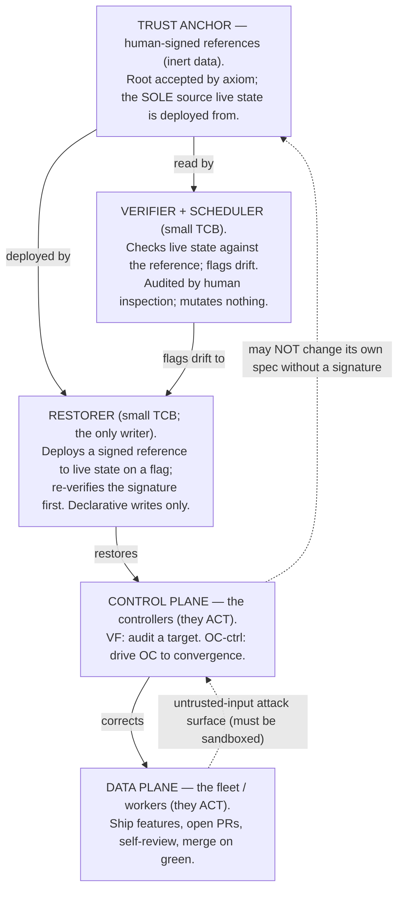

# Control Plane and Anchor

This note fixes the vocabulary for the pieces that are easy to conflate: the
**data plane** (the autonomous fleet that does the work), the **control plane**
(the supervisory "controllers" that watch a target and correct its drift), the
**verifier** and **restorer** (the small trusted core that checks and repairs
the control plane), and the **trust anchor** (the human-signed fixed point the
whole structure is verified *against*). It exists because the supervisory
responsibility is currently bolted onto OperationsCenter itself, and we keep
reaching for a mental picture — "a supervisor that lives *above* OC" — that is
subtly but importantly wrong.

> **Terminology warning — two unrelated meanings of "anchor."** Elsewhere in
> this ecosystem "anchor" means **session anchoring**: a working-repo session
> binds its `.context/` state to its owning manifest via ContextLifecycle
> (`cl session start` → `CL_ANCHOR`; see
> [cognition-memory-overview.md](cognition-memory-overview.md) §1 and
> [contextlifecycle-anchoring.md](contextlifecycle-anchoring.md)). That is a
> *state-binding mechanism*. The **anchor in this document** is a *trust root* —
> the PKI sense of a **trust anchor**: a reference accepted by axiom because a
> human provisioned it, not because anything above it vouched for it. Same word,
> unrelated concept. Where ambiguity is possible this doc says **trust anchor**.

The core claim is two sentences. **(1)** These are not layers stacked by
altitude; they are a single **correction chain**, and the only architecturally
interesting question is *where the chain grounds*. **(2)** It must ground in
something a human signed and the machinery cannot rewrite, because the real
problem is **separation of powers** — a component must not be able to rewrite the
rules that bound it.

> **Framing caution the rest of this note depends on.** What follows establishes
> **properties** the architecture must have — an unforgeable spec, a monotonic
> envelope, a grounded regress, authority decoupled from availability. It does
> **not** prescribe their **implementation**. In particular, "lift the control
> plane out of OC" (below) is a separation of **authority** — OC's identity must
> not be able to write its own anchored spec — **not necessarily a separation of
> address space**. An in-process corrector holding no write path to its own
> reference already has separation of powers. "Separation of powers" here is the
> capability-security sense (a different privilege ring), not the constitutional
> one (a different building).

## The thesis: separation of powers, not altitude

The intuitive picture is `worker → controller → super-controller`, each taller
and smarter than the last. That is a trap: a "smarter super-controller" that can
rewrite the controllers can also rewrite the limits on itself, so it grants no
new safety — it just moves the conflict of interest up one floor (see
[the regress](#the-regress-it-grounds-it-does-not-vanish)). The honest picture is
a chain of *corrections* that bottoms out at a reference a human signed and the
machinery is forbidden to change without a fresh signature:



The trust anchor is drawn at the **top** only because it *bounds* everything
below it; conceptually it is the **floor** — the irreducible base of trust, not a
ceiling of greater intelligence. That metaphor is exposition, not proof: it does
not by itself make the anchor un-forgeable or available (those need mechanism —
see [Threat model](#threat-model-for-the-anchor) and
[Availability vs. authority](#availability-vs-authority)).

The chain is really a small **tree**, not a line: the verifier checks *each*
controller, each controller corrects *its own* target. And one scope limit
matters: this is a decomposition along a **single axis — where trust grounds** —
and deliberately **not** the operational/threat decomposition. Along the threat
axis the load-bearing variable is whether a component **ingests untrusted input**
(a worker's output, an external PR), and on *that* axis a "control-plane"
component like the PR reviewer can be compromised *by* the data plane it sits
above — the dotted `DP → CP` edge. This project has a real incident of exactly
that (a reviewer running untrusted PR code in a live checkout). Keep the two cuts
separate.

## The roles

| Role | What it does | Held to account by | May touch |
| --- | --- | --- | --- |
| **Data plane** (fleet/workers) | Feature work: implement, test, open PR, self-review, merge on green. | The control plane, autonomously. | Application/feature code, within policy scope. |
| **Control plane** (controllers) | *Acts.* Watches a target, detects drift/rot, applies corrections. Two instances today: VF (audit monitor) and OC-ctrl (drives OC toward convergence). | The verifier, against its signed reference; restored toward spec by the restorer; its *spec* changes only by human signature. | The data plane and its target's operational state — **not** its own anchored spec. |
| **Restorer** (actuator; small TCB) | *The only writer.* On a verifier flag, deploys the controller's signed reference to live state; **re-verifies the signature on the artifact first**. Declarative writes only ("set to signed-digest D"), never arbitrary mutation. | Human inspection (small, in the TCB) + the dead-man's switch (its own liveness). | Live config/code of the control plane — but only ever *to* a signed reference. |
| **Verifier** (+ scheduler; small TCB) | *Checks, never mutates.* Runs the `[check: ref]` comparison of live state against the signed reference; flags drift. | Human inspection (small enough to audit by eye) + the same monotonic policy it enforces. | Nothing — it reads and reports. |
| **Trust anchor** | *Inert.* The human-signed references themselves, and the pinned public key used to verify them. | A human, at signing time. | Nothing — it is data. |

`VF` and `OC-ctrl` are working labels for two *roles*, not established component
names; VF's full definition lives outside this repo. Every "cannot / may not"
above is today mostly **ACL-enforced** (a credential the fleet lacks, a status it
may not post), not yet cryptographically guaranteed — read them as "must-not, and
is being made can-not" (see [Threat model](#threat-model-for-the-anchor)).

## The regress: it grounds, it does not vanish

Every self-fixing system hits the classic regress: the thing that fixes `X` must
itself be fixed by something; you cannot have infinite turtles. The first draft
of this note claimed the chain *terminates* at an anchor that "needs no
corrector." Too strong — and the overstatement hides the real work.

"Verify against a human-signed reference" is not one thing; it is several, with
different drift profiles:

1. **The reference** — the signed bytes. Genuinely inert; needs no corrector,
   exactly like a **trust anchor** in PKI: a root accepted by axiom because a
   human installed it, never because something above it signed it. The regress
   has nowhere to climb.
2. **The verifier** — code that compares live state to the reference. It
   *executes*, has bugs, and *can* drift (a `[check: ref]` that greps the wrong
   path passes green forever).
3. **The scheduler** — makes the check *run*, on a cadence. A live actor whose
   availability can fall to zero.
4. **The restorer** — the only writer; deploys the signed reference back to live
   state. The most dangerous component in the system, because it holds
   control-plane write authority.

So the regress is not escaped; it is **shrunk**. The chain grounds in the inert
reference (1), leaving a small **trusted computing base** — verifier, scheduler,
*and restorer* (2–4) — that we do not correct by machine. Instead we hold it
immutable-except-by-signature and **audit it by human inspection**. That audit is
itself a human in a loop — but it is acceptable *here and only here* for a
specific reason, and the reason is **not** "it is small." It is that this loop
sits at the **rarely-changing anchored root**, where the signature rate is
deliberately minimized, whereas the operator-in-every-correction pattern this
project already rejected sat on the **unbounded per-correction path** (rate set
by fleet throughput). "Rare by construction" is the legitimizing property;
"small" is only what keeps each already-rare event cheap.

The liveness corner (3) recurses — the watchdog that proves the check ran needs
its own watchdog — and here is a correction to the first draft: that recursion
does **not** bottom out at "an inert external signal." A liveness signal is the
*opposite* of inert; it is a live actor whose whole job is to keep running. The
honest terminus of a liveness recursion is **a human's attention** (a page, a
daily glance). A dead-man's switch does not remove that human; it **shortens
time-to-human-notice** and moves the final observer *out of the monitored failure
domain*. So the rule is: "no news" must fail **loud**, the alarm consumer must be
**failure-domain-disjoint** (independent infra, identity, egress) from the fleet,
and a human remains the floor of liveness — stated, not hidden. (See also
[Availability](#availability-vs-authority).)

## What a human signs, and how often

This is the reconciliation the first draft skipped. The
[self-healing invariant](#related) says the system "always corrects itself with
**no human in the per-correction loop**," yet control-plane changes require human
review. Those are only contradictory if you conflate two operations:

- **Enforce / restore** — drive a plane back toward its *existing* signed
  reference. Mechanical, no human.
- **Change / expand** — alter what a plane *is*: its policy, scope, the reference
  itself. A **new judgment**, requiring a fresh human signature.

The human **changes the reference; it does not enforce it.** But that only holds
if "restore to spec" is decidable *without knowing intent* — and intent is
exactly what only the human has. (Concretely: the reference says `max_turns=50`;
live reads `500`. Is that drift to revert, or a legitimate human raise whose
reference hasn't propagated? The bytes are identical; only intent disambiguates.)

The fix is to **remove the thing that needs classifying**: make the signed
reference the **sole writer** of the control plane's live config —
*deploy-only-from-signed-reference*. There is no independent "live config" that
drifts on its own and then needs its intent reconciled. Then:

- "Drift" can *only* mean **unauthorized divergence from the signed bytes** —
  restoration is unconditional and safe, no intent-classifier needed, and there
  is no poisoned second copy for a restorer to re-apply (closing an
  anchor-capture-via-restorer hole).
- A *legitimate* change is *only ever* the human **re-signing the reference** —
  never an edit to live state a restorer must guess about. The `max_turns`
  ambiguity dissolves: either the human signed `500` (not drift) or they did not
  (drift → restore to `50`, unconditionally).

This makes **config and code** drift decidable and safe. It does **not** cover
**behavioral** drift: an LLM-agent controller handed an unchanged, signed prompt
can still drift in output — the envelope-creep "reclassify the path as
autonomous" move needs no diff to any artifact. Behavioral drift has no signed
artifact to redeploy to, so it **cannot be auto-restored**; it degrades to
**quarantine-and-flag**: stop the drifted controller, hold the data plane on
last-good, escalate to a human-signed judgment. And even for config/code, the
restorer must **bound its restore-rate and detect restore-loops** — restore →
re-drifts → restore means the *cause* is upstream (a poisoned target or a stale
reference) and must escalate, not flap.

So the control plane self-heals **drift** but not its own **defects**: fixing a
genuine bug in governance logic means *changing* the signed reference, and the
system cannot tell a real fix from a capability-expanding exploit without the
human who owns the judgment. Governance bug-fixes are human-signed new judgments,
by design.

Three honesty corrections to "encode once":

- It is **encode once *per judgment***, and judgments recur — every PR needs its
  verdict, every credential rotation a re-sign. The human is a *recurring signer
  of new references*, not a continuous step in an enforcement loop. The
  discipline is to **minimize the rate**, not pretend it is zero.
- Routing *every* control-plane correction (including mechanical restoration)
  through a human would re-create the rejected "operator-in-every-correction"
  pattern. Keep enforcement mechanical (deploy-from-signed); gate only new
  judgments.
- What shrinks is the **cadence** of human judgment, not its **difficulty**.
  Signing a reference demands the same "understand and bless this" as approving
  the correction it replaces; authoring a durable `[check: ref]` is *harder* (and
  more dangerous when subtly wrong — a false all-clear). The genuine wins are
  fewer such acts and **decoupling the fleet's uptime from the human's** (hold
  last-good while the human is away, instead of halting). Neither is reachable by
  "just approve every PR," which halts the fleet whenever the operator is away —
  the multi-day-deadlock failure mode.

## The policy plane today: what is real, and what is not

The first draft claimed the system *empirically revealed* the anchor surface,
quoting a precise `require_review` log line and asserting "we did not design that
moment." Two corrections:

**The quote was a reconstruction.** The locally-verifiable artifact is a lease
record at `.context/sessions/s-2026-06-08-af23/active/l-64cc79e2…yaml`:

```yaml
status: skipped
failure_category: policy_blocked
failure_reason: 'execution blocked by policy: blocked on retry'
```

That is real, and it proves a narrow, useful thing: **the policy plane has a
`policy_blocked` category that halts autonomous execution, and it fires.** It
does *not*, alone, show a clean "control-plane changes → require_review" boundary;
that classification is OperationsCenter policy behavior living in a sibling repo,
not a verbatim local artifact. Don't quote what you can't cite.

**It was a reconfirmation, not a discovery.** A human earlier *wrote* the policy
boundary; the gate firing is the system **obeying a line a human already drew** —
the `[check: ref]` pattern doing its job (the boundary is encoded, wired, and
load-bearing; dead config would be worse). But the gate reports its own
configuration, not ground truth. The argument for *why* the boundary belongs at
the control-plane line is **separation of powers**, not the gate's own output.

## Threat model for the anchor

The anchor's value is the property "the control plane **cannot** rewrite or forge
it." That has to be *constructed*, not asserted. These are the failure modes that
void the trust model, and the mechanism each demands.

- **Anchor capture** — the control plane writes the reference, so the verifier
  forever compares against an attacker-controlled "good." Mitigation: store
  references where the control-plane *identity* has **no write capability** — a
  different repo, a different credential. The read-only credential bind (the
  fleet cannot mint its own trust) is already an instance, and an anchor, not a
  bug.

- **Restorer compromise** — the restorer is the only writer with control-plane
  deploy authority; it is strictly more dangerous than the read-only verifier and
  was missing from the first draft's TCB count. Capture it and you need not forge
  the reference — you own the hands that deploy it. Mitigations: it
  **re-verifies the signature on every artifact** before deploying (so a
  compromised *verifier*'s flag cannot direct a malicious restore); its writes
  are **declarative-only** (set-to-signed-digest); it is small enough for the
  human-audited TCB; and its liveness rides the dead-man's switch.

- **Signature forgery** — today "human-signed" mostly means **access control**: a
  `reviewer-verdict` status a human posts, gated by a token. Anything holding the
  token can post it; ACL-anchoring is weaker than it sounds (this project's
  history records the boundary leaking — an un-sandboxed reviewer executor, a
  content-less boundary "secret"). Hardening moves toward **cryptographic
  anchoring** — but crypto **relocates the bootstrap, it does not remove it**: the
  verifier must hold the **public key** to check against, and if the control plane
  (or the restorer) can swap that key, it signs forgeries with its own and the
  check passes green. So: (a) the public key is **pinned in the TCB** — baked into
  the verifier, fingerprint human-audited, immutable-except-by-signature, not
  config; (b) the *signing* key lives **off the fleet's infrastructure trust
  boundary** (offline / HSM / hardware token), because "the fleet cannot reach it"
  is a property of *infra control*, not file permissions — a KMS the fleet's
  cloud account can call satisfies the words and fails the intent under a
  compromised plane; (c) honestly, crypto converts a *forgery* problem into a
  *key-substitution + key-custody* problem, both terminating at the same
  human-provisioning axiom as everything else. That IS the floor — state it;
  don't imply crypto closes what it relocates.

- **Envelope creep** — the control plane runs `audit → investigate → fix`, and one
  in-character "fix" is *"this gate causes a stall; reclassify the path as
  autonomous."* That widens its own envelope, and if the change is feature-shaped
  it may merge on green. Mitigation is **monotonicity** — but "tighten vs. loosen"
  is **not a single axis**: one change can narrow scope on one axis while
  expanding autonomous reach on another (narrow files to `src/` **and** flip
  `src/`'s merge gate to merge-on-green), and a netting rule lets the machine
  self-approve the bundle under its "tightening." So monotonicity is a
  **conjunction over every axis, no netting**: *any* loosening on *any* axis taints
  the whole change and requires a signature, regardless of tightenings elsewhere —
  and the policy schema must **enumerate the axes** (a closed list) so "any axis"
  is well-defined rather than left to the proposer to frame. And the closure that
  makes it real: **the policy that defines the anchor surface is itself inside the
  anchor surface** — otherwise the gate is a lock whose key sits in the room it
  guards.

- **Self-reference is not self-grounding** — "the policy is inside the anchor
  surface" closes the diagram on paper but leaves a bootstrap: who signs the
  zeroth policy? It cannot derive authority from itself. So **v0 is installed by
  axiom** (human-provisioned, out-of-band — the PKI trust-anchor move again);
  thereafter v_n is signed under v_{n-1}, a well-founded chain grounding at the
  axiomatic v0. The policy file also needs a place on the ACL→crypto spectrum like
  every other reference — today it is the one surface item with no mechanism
  named.

- **Staleness / liveness blindness** — a `[check: ref]` only protects while it
  *runs*; if its scheduler dies, *nothing reporting* reads identically to
  *everything green*. **Absence of an alarm must never be the all-clear.** This is
  a *distinct* failure from a **silent-wrong-check** (a check that runs fine but
  greps the wrong thing, green forever) — and they need **different** mitigations:
  staleness → the dead-man's switch (catches absence); silent-wrong-check → the
  human TCB audit (the heartbeat fires normally, so only inspection catches it).
  Neither covers the other.

## Availability vs. authority

"Central, human-tied" addresses *correctness* (less to drift); it says nothing
about *availability*, and conflating the two makes the floor a single point of
failure. If references, verifier, restorer, or the signing human are unavailable,
the control plane freezes. The [self-healing invariant](#related)'s two structural
tests apply:

- **No bootstrap deadlock** — the verifier/restorer must run at a tier whose own
  repair path is not gated by the anchor it serves. The apparent paradox
  ("verifier is immutable-except-by-signature" ∧ "must be repairable when the
  signing human is away") dissolves under deploy-from-signed: verifier/restorer
  restoration is itself a deploy of the **pre-signed** image — no *live* human
  needed, only the once-signed artifact. And a broken verifier must itself **trip
  the loud-fail heartbeat** (it is a staleness event), or "hold last-good"
  silently re-enters the blindness mode.
- **Degrade, never halt** — when the signing human is unavailable, the control
  plane degrades to **hold last-good policy** (keep the data plane on the most
  recent signed reference, queue pending *judgments*), never a hard stop.

Concretely: **central authority ≠ single copy.** Replicate and content-address
the signed references so the *data* is highly available even though the
*authority* to change it is central. (This project has paid for
halt-instead-of-degrade once, in a multi-day goal-lane deadlock.)

## What to formalize (and what not to)

1. **Separate the authority, not necessarily the address space.** OC today can,
   in principle, rewrite the rules that bound it — *that*, not its execution
   locus, is the conflict of interest. What must move outside the data plane's
   identity is **write-authority over the anchored spec** (a credential the fleet
   cannot use), not the corrector's process. An in-process corrector with no write
   path to its own reference already has separation of powers, and keeps the deep
   target access (in-process state, leases, venv, PATH) this project's debugging
   history shows is needed. Lifting to a separate *tier* also buys a new
   bootstrap-deadlock/freeze surface — take that on only if a credential boundary
   alone won't do.

2. **Extract the *mechanism*; keep the *policies* separate.** Don't "factor the
   two controllers into one component with two configs" — a wrong-abstraction risk
   at N=2. VF is **drift-detection against a reference** (success = "matches");
   OC-ctrl is a **convergence driver** (success = "reached setpoint"; failure
   modes = oscillation/stall). What is shared is the *boring* substrate —
   scheduling, target-connection, run-capture, the `[check: ref]` plumbing, the
   deploy-from-signed restore path. Extract **that** as a harness; keep
   audit-monitor and convergence-driver as **distinct policies** over it. Defer
   any "one component" claim until a *third* controller triangulates the variation
   axis.

3. **The anchor is a discipline, not a service.** Do **not** build "a bigger brain
   above OC." Formalizing means **shrinking** the human's signed set and
   mechanizing reconfirmation around it — and hardening references from
   ACL-anchored toward cryptographically anchored. Narrow and strengthen; never
   grow a taller autonomous layer.

### Proportionality: build the minimum anchor now

The motivating evidence is five blocked self-heal tasks (smoke-test,
surface-stderr, circuit-breaker, infra-error-robustness, OAuth-refresh). Read them
honestly: several are genuinely control-plane/anchor-adjacent — OAuth-refresh
touches the **credential anchor itself**; circuit-breaker and
infra-error-robustness touch executor self-healing — so the gate blocking them is
mostly *correct*, and they belong to the harness under human-signed review (this
*supports* the thesis). One or two (smoke-test, stderr surfacing) sit closer to
observability chores the gate may *over*-catch — itself a signal to **sharpen** the
anchor surface's scoping, not to widen autonomy.

Either way, five tasks justify only the **minimum viable anchor now**:
deploy-from-signed restoration, the per-axis monotonicity rule, and the
self-referential policy closure — those alone stop an autonomous self-merging
fleet from widening its own bounds. Replicated/content-addressed references, the
dead-man's-switch watchdog, and the ACL→crypto migration are **hardening to
sequence behind demonstrated need**, not to build off this evidence. Apply the
doc's own "discipline, not a service" restraint to the *whole* apparatus, lest the
anchor cost more than the autonomy it buys.

### The encode-once anchor surface

The anchor is whatever a human must sign that the control plane cannot forge.
Today this includes:

- **Credential / identity** the fleet cannot self-refresh (read-only by design).
- **Signed verdicts** — the `reviewer-verdict` status and the merge authority
  gated on it (today ACL-anchored; a hardening target).
- **Policy review-required boundaries** — the scope rules forcing control-plane
  changes through review, *including the rule-file itself* (self-referential
  closure, grounded at an axiomatic v0).
- **`[check: ref]` references** — a human judgment encoded once per judgment, with
  *both* failure modes covered: staleness → dead-man's switch; silent-wrong-check
  → human TCB audit.
- **The pinned verifying public key** — once crypto-anchored, the key itself is
  anchor surface (pinned in the TCB, fingerprint human-audited).

## Open questions

- **Where do the signed references physically live** such that the control-plane
  identity has no write path — separate repo, separate credential, detached
  signature?
- **The restorer's exact write scope and credential** — declarative-only deploy of
  signed digests; what its compromise costs and what bounds its restore-rate.
- **How far along the ACL→crypto spectrum is worth it now**, given the project's
  history of ACL-style boundary leaks and the off-infra signing-key requirement.
- **Where does the control-plane harness live** — and is a credential boundary
  enough, or is a separate tier (with its new freeze surface) actually required?
- **Quarantine-and-flag for behavioral drift** — who consumes the flag, with what
  authority, and what is the bounded queue while the signing human is away?

## Summary

- **Data plane** — does the work; corrected by the control plane; autonomous
  in-scope.
- **Control plane** (two controller *roles*) — *acts*; self-heals **drift** (via
  deploy-from-signed) but not its own **spec** or **defects**, which change only
  by human signature; behavioral drift degrades to quarantine-and-flag. Extract a
  shared harness; keep two distinct policies — don't over-unify at N=2.
- **Restorer** — the only writer; deploys signed references, re-verifying each;
  the most dangerous component, so declarative-only and inside the audited TCB.
- **Verifier** — *checks, never mutates*; with the scheduler and restorer, the
  small TCB we audit by inspection because it sits at the rarely-changing root.
- **Trust anchor** — *inert*; the human-signed references (and pinned key) the
  structure is verified against; the floor where the regress *grounds*. A
  discipline to shrink and harden, not a service to grow.

Every "cannot" above is today mostly **ACL-enforced**, not yet cryptographically
guaranteed: the architecture states the target properties; the mechanisms that
make them true are the work. The thing that feels like "a supervisor above OC" is
real — but it is the **floor of the control plane, not a ceiling above it**, and
its power is the power to *bound and verify*, never the power to *act*.

## Related

- The **self-healing invariant** — the system corrects itself with no human in the
  per-correction loop; a human appears only at the encode-once anchored root; with
  three structural tests (degrade-never-halt, no bootstrap deadlock, human only at
  the anchored root). This doc is the architectural account of *where* that root
  is and *how* it is verified.
- [cognition-memory-overview.md](cognition-memory-overview.md) — the *other*
  meaning of "anchor" (session-state binding); see the terminology warning above.
- [contextlifecycle-anchoring.md](contextlifecycle-anchoring.md) — notes that an
  OC session "must read the anchor's compiled context explicitly," an early hint
  that OC is itself a correctable target rather than a top authority.
- [platform_topology.md](platform_topology.md) — OC's role as governance /
  orchestration, which this doc refines into "worker + its own corrector, to be
  separated by authority."
