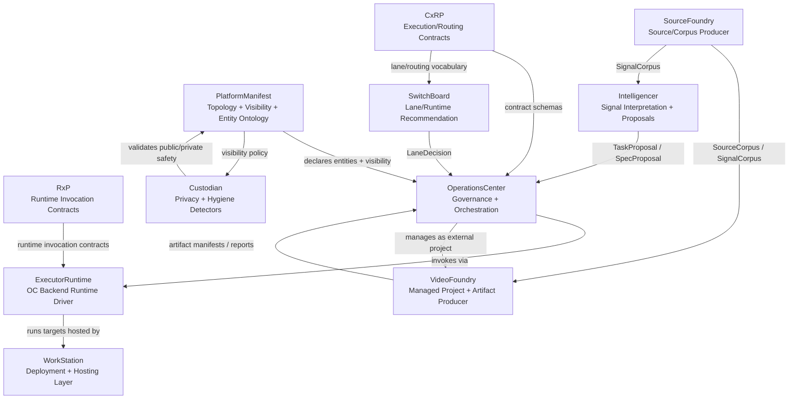
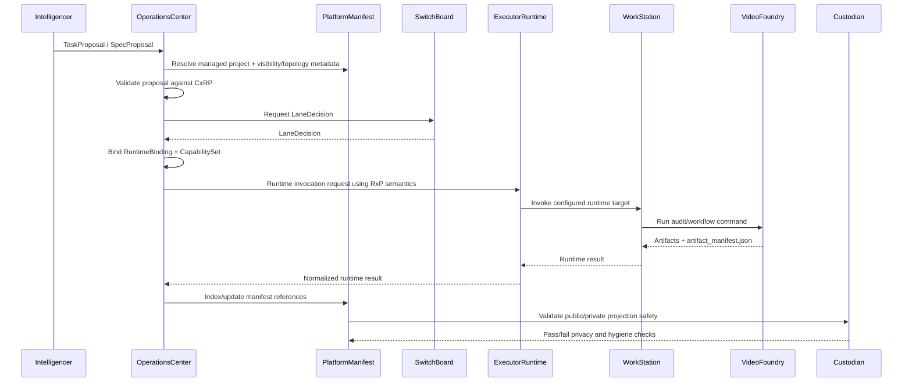

# Platform Topology

PlatformManifest describes platform topology and entity relationships. It is
not a runtime registry and not a protocol-schema repository.

## Topology Roles

| Component | Role |
| --- | --- |
| PlatformManifest | Topology, visibility, entity ontology, projection policy. |
| CxRP | Execution/routing contracts and vocabulary. |
| RxP | Runtime invocation and return contracts. |
| OperationsCenter | Governance, validation, orchestration, enforcement. |
| SwitchBoard | Lane and runtime recommendation. |
| ExecutorRuntime | Runtime backend/driver used by OperationsCenter. |
| WorkStation | Deployment and hosting layer for runtime environments. |
| VideoFoundry | Managed project, artifact producer, and reference testbed. |
| SourceFoundry | Source/corpus producer. |
| Intelligencer | Signal interpretation and proposals. |
| Custodian | Privacy and hygiene detectors. |

## Repo Topology Diagram

## Execution Timeline

PlatformManifest participates as topology and visibility metadata. It does
not execute work and does not own CxRP or RxP schemas.

## Consumption Rules

OperationsCenter reads PlatformManifest to resolve managed projects,
repositories, topology, and visibility metadata. It can validate proposals
against CxRP and invoke ExecutorRuntime using RxP semantics, but those
contract schemas stay in their owning protocol repositories.

SwitchBoard can consume repo context as input for lane/runtime
recommendation, but it does not own manifest loading, merging, runtime
dispatch, or project wiring.

WorkStation may expose deployment and hosting information such as local
runtime availability or configured target location. It must not own
PlatformManifest, ProjectManifest, or orchestration policy.

VideoFoundry fits as an external managed project and reference testbed for
OperationsCenter contracts. It can demonstrate artifact production, audit
workflows, and manifest consumption without becoming part of the
OperationsCenter codebase.
