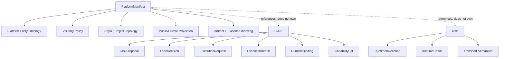
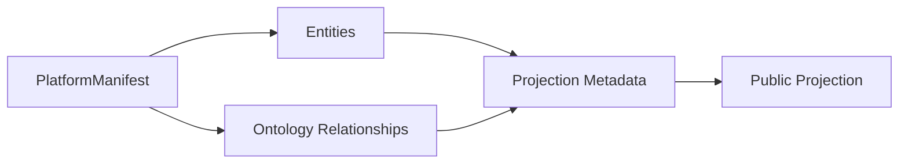

# PlatformManifest Ontology

PlatformManifest is the platform-level ontology and visibility registry.
It answers what exists in the platform, how entities relate, and what may
be safely disclosed. It preserves the original manifest purpose: separate
public-facing repository knowledge from private-facing repository knowledge
through policy-driven projection, privacy checks, and private supersets.

```text
PlatformManifest owns what exists and what may be disclosed.
CxRP owns execution/routing contract semantics.
RxP owns runtime invocation semantics.
OperationsCenter owns governance and orchestration implementation.
ExecutorRuntime performs runtime invocation for OperationsCenter.
PlatformDeployment deploys and hosts runtime environments.
Managed private projects remain external to orchestration consumers.
Custodian detects leaks and hygiene violations against declared policy.
```

```text
Private manifests are supersets.
Public manifests are safe projections.
Unknown visibility fails closed.
Projection is policy-driven and testable.
Contract schemas stay in their owning protocol repos.
```

## Responsibility

PlatformManifest owns platform topology, entity ontology, manifest-shape
semantics, visibility policy, projection rules, and manifest provenance. It
may reference protocol schemas
by stable identifier, package name, schema URI, or repository relationship,
but it must not copy or redefine CxRP or RxP contracts.
PlatformManifest references CxRP and RxP rather than owning their schemas.

CxRP remains the execution and routing contract ontology. It owns
`TaskProposal`, `SpecProposal`, `LaneDecision`, `ExecutionRequest`,
`ExecutionResult`, `RuntimeBinding`, and `CapabilitySet` semantics.

RxP remains the runtime invocation and return contract ontology. It owns
`RuntimeInvocation`, `RuntimeResult`, and transport semantics used by runtime
drivers.

OperationsCenter consumes PlatformManifest as validated topology and
visibility metadata. It does not own the PlatformManifest ontology, and it
does not redefine public/private policy.

ExecutorRuntime is the runtime backend and driver used by OperationsCenter
to invoke work using RxP semantics. PlatformDeployment is the deployment
and hosting layer for runtime environments; it is not the OperationsCenter
execution backend.

PlatformDeployment is the deployment and hosting layer.

Managed private projects can publish artifact manifests, reports, and audit
outputs that OperationsCenter consumes, but they are not part of
OperationsCenter and must not import platform core internals.

## Data vs Model Ownership

PlatformManifest owns the manifest model, schemas, composition rules, and
visibility invariants for `platform`, `private`, `project`, `work_scope`,
and `local` manifest shapes.

That does not require all manifest documents to live in this repo:

* the public platform base may ship with `PlatformManifest`
* private topology documents may live in a dedicated private topology repo
* local overlays remain machine/user-owned and unpublished

## Entity Shape

The ontology-level entity shape is intentionally generic:

```yaml
id: stable_entity_id
kind: Repository
name: CanonicalName
visibility: public
owner: protocolwarden
scope: platform
relationships: []
metadata: {}
```

Every entity must have:

| Field | Meaning |
| --- | --- |
| `id` | Stable machine identifier. |
| `kind` | Ontology kind, such as `Project`, `Repository`, or `Manifest`. |
| `name` | Human-readable canonical name. |
| `visibility` | `public`, `private`, or an explicit restricted policy value once modelled. Unknown values fail closed. |
| `owner` / `scope` | Owning organization, project, work scope, or platform layer. |
| `relationships` | Explicit typed edges to other entities. |
| `metadata` | Non-contract descriptive metadata with field-level visibility rules. |

The shipped Python model now exposes:

* manifest kinds: `platform`, `private`, `project`, `work_scope`, `local`
* entity vocabulary through `RepoNode.kind`
* explicit projection metadata on entities
* explicit ontology relationships alongside repo-graph edges

Repo-graph edges remain for compatibility with existing consumers. The
first-class ontology relationship layer now carries the visibility and
projection metadata used for public/private policy enforcement.

## Entity Vocabulary

| Kind | Purpose | Notes |
| --- | --- | --- |
| `Project` | Logical product or work unit. | May be public or private. |
| `Repository` | Source repository identity. | Base kind for public/private/protocol repositories. |
| `ManagedProject` | Project managed by OperationsCenter. | External to OC. |
| `ManagedRepository` | Repository managed or indexed as part of a project. | May include private implementation repos. |
| `PublicRepository` | Publicly disclosable repository. | May appear in public manifests. |
| `PrivateRepository` | Private repository or private implementation surface. | Must not appear in public manifests unless projected/redacted. |
| `ProtocolRepository` | Repository owning protocol schemas. | CxRP and RxP are referenced, not absorbed. |
| `ArtifactProducer` | Entity that produces artifacts or reports. | Example: a managed project. |
| `DeploymentLayer` | Hosting/deployment environment layer. | Example: PlatformDeployment. |
| `ExecutionBackend` | Runtime backend/driver. | Example: ExecutorRuntime. |
| `Manifest` | Manifest document or generated manifest output. | Public manifests are projections of private manifests. |
| `Artifact` | Produced file, bundle, report, or metadata object. | Public-safe metadata may be projected. |
| `Run` | Execution or workflow run record. | May reference RxP/CxRP identifiers. |
| `Audit` | Validation or audit activity. | May produce evidence. |
| `Evidence` | Supporting proof, report, or detector result. | Must carry visibility. |
| `Binding` | Association between a managed entity and a platform/runtime capability. | Private bindings are redacted from public projections. |
| `VisibilityPolicy` | Policy describing allowed disclosure. | Owned by PlatformManifest. |
| `ProjectionRule` | Rule for deriving public output from private input. | Must be testable. |
| `RedactionRule` | Rule for removing or replacing private details. | Fail closed by default. |
| `MirrorRelationship` | Public/private mirror or documentation relationship. | Queryable relationship. |
| `SupersetRelationship` | Private superset to public subset relationship. | Queryable relationship. |

## Manifest Shapes

| Manifest kind | Role |
| --- | --- |
| `platform` | Public reusable platform base. |
| `private` | Private platform superset. May contain multiple managed private projects, private topology, and projection descriptors. |
| `project` | Per-project manifest slice. |
| `work_scope` | Multi-project operational/work overlay. |
| `local` | Runtime-only machine or user overlay. Never published. |

## Relationship Vocabulary

Relationship edges are explicit and closed by default. Public-safe edges
must be marked as public-safe; private-only edges must never leak into
public manifests.

| Relationship | Meaning |
| --- | --- |
| `projects_to` | Private or source manifest projects into a public manifest. |
| `redacts_from` | Public entity is a redacted form of a private entity. |
| `implements` | Private implementation realizes a public contract, repository, or project. |
| `documents` | Public repository documents a private or protocol entity. |
| `manages` | Governance entity manages a project or repository. |
| `orchestrates` | Governance entity orchestrates work for a managed entity. |
| `produces_artifacts_for` | Producer emits artifacts for a project, run, or manifest. |
| `consumes_manifest_from` | Consumer reads manifest metadata from another entity. |
| `references_schema_from` | Entity references a schema owned by a protocol repository. |
| `deploys` | Deployment layer deploys a runtime target or project surface. |
| `hosts` | Hosting layer hosts an execution or service environment. |
| `validates_with` | Manifest or artifact is validated with a declared policy or detector surface. |
| `loads_plugin_from` | Runtime loads a plugin or native contributor from another entity. |

## Projection Metadata

Entities and ontology relationships carry explicit projection metadata. The
current vocabulary includes:

```text
visibility
projection_policy
projection_behavior
public_alias
redaction_label
private_binding_refs
local_overlay_refs
```

Unknown visibility or unknown projection behavior fails closed.

## Ontology Responsibility Diagram



## Ontology Relationship Surface


