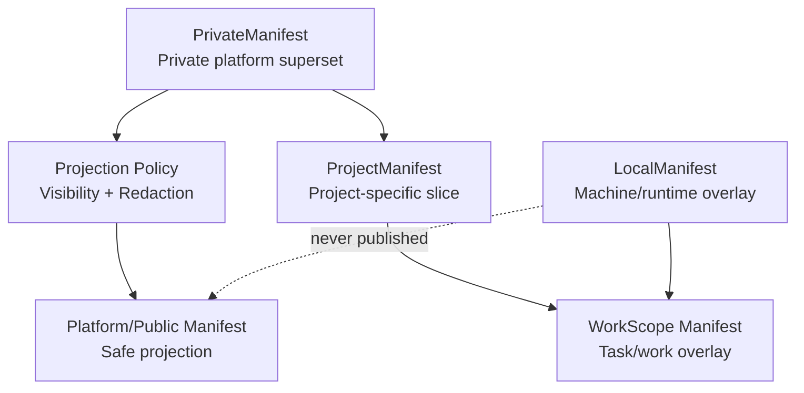
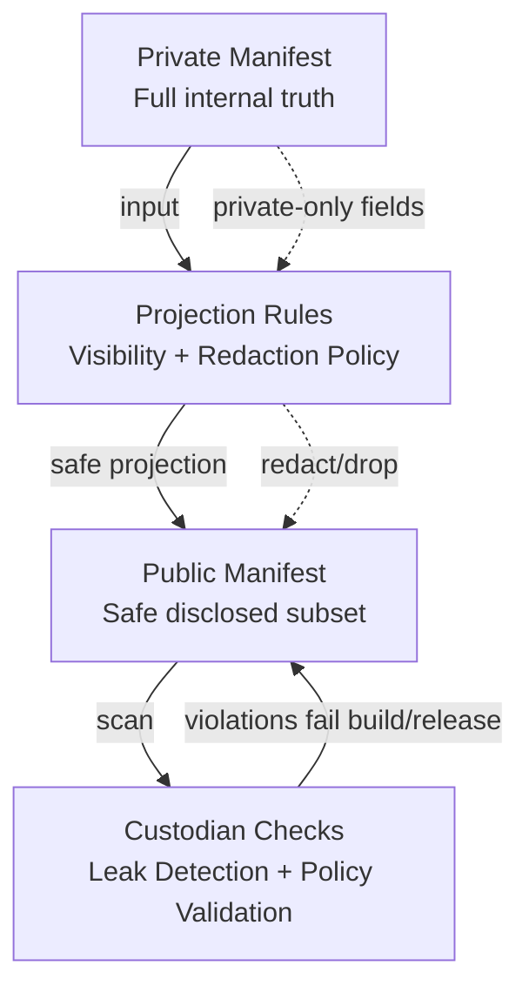
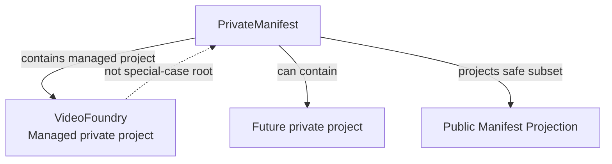

# Public And Private Projection

PlatformManifest preserves a strict visibility boundary:

```text
private manifest = full internal truth
public manifest  = safe projection of private manifest
```

The manifest shapes are now explicit:

```text
Platform/Public Manifest = safe public projection
Private Manifest         = private platform superset
Project Manifest         = project-specific slice
WorkScope Manifest       = operational work overlay
Local Manifest           = machine/user/deployment overlay
```

Layering is:

```text
Private Manifest -> Projection Rules -> Platform/Public Manifest
Private Manifest -> Project Manifest -> WorkScope Manifest
Local Manifest -> runtime-only overlay on the effective graph
```

Public manifests must be generated from private or superset input plus
explicit projection rules. They must not be separately hand-authored copies,
because hand-authored public manifests drift away from private truth and make
privacy review untestable.

## Projection Rules

Projection is policy-driven and testable. The default behavior is fail
closed:

* Private manifests may contain public and private entities, private repo
  names, internal paths, private bindings, private deployment topology,
  private artifact locations, internal policy notes, private environment
  assumptions, and restricted relationship edges.
* Public manifests may contain only public repo names, public project
  descriptions, public-safe relationship edges, public schema references,
  public artifact metadata, public license metadata, public documentation
  links, and redacted placeholders allowed by policy.
* Unknown visibility defaults to private or non-disclosable.
* Private-only fields are dropped or redacted unless a field-level rule
  explicitly allows projection.
* Projection rules must be deterministic enough for CI tests and Custodian
  detectors.

The shipped model makes projection metadata explicit on entities and
relationships:

* `visibility`
* `projection_policy`
* `projection_behavior`
* `public_alias`
* `redaction_label`
* `private_binding_refs`
* `local_overlay_refs`

Projection behavior uses a constrained vocabulary:

```text
public_safe
private_only
local_only
redact
redacted_public_stub
drop_from_public
```

No entity or relationship may be projected publicly unless its effective
projection behavior is public-safe or an explicitly allowed redacted stub.

## Field Classes

| Field class | Private manifest | Public manifest |
| --- | --- | --- |
| Public identity | Allowed | Allowed |
| Private identity | Allowed | Drop or redact |
| Internal path | Allowed | Forbidden |
| Private URL | Allowed | Forbidden |
| Public schema reference | Allowed | Allowed |
| Private schema URI | Allowed | Forbidden |
| Public artifact metadata | Allowed | Allowed |
| Private artifact location | Allowed | Drop or redact |
| Binding detail | Allowed | Redacted unless public-safe |
| Deployment topology | Allowed | Forbidden unless explicitly public |
| Relationship edge | Allowed | Only when public-safe |

## Superset And Subset Relationships

Private manifests are supersets. Public manifests are safe projections.
Superset/subset relationships must be queryable so consumers can ask which
private entity backs a public projection without exposing private details in
public output.

Examples:

```text
PrivateRepo contains implementation details for PublicRepo
PublicRepo documents public contract for PrivateRepo
PrivateManifest projects into PublicManifest
PrivateBinding is redacted from PublicBinding
```

Relationship handling rules:

* Private-only edges must never leak into public manifests.
* Public-safe edges must be explicitly marked public-safe.
* Redacted edges may expose existence without exposing details only when
  policy allows it.
* Superset/subset relationships must be queryable inside private manifests.
* Public projections may expose only the safe side of a relationship or an
  allowed redacted placeholder.

## Minimal Projection Contract

Future model work should add a projection contract equivalent to:

```yaml
projection_rules:
  - id: public-repo-identity
    source_kind: Repository
    output_visibility: public
    allowed_fields:
      - id
      - kind
      - name
      - visibility
      - public_description
      - github_url
      - license
      - documentation_url
    redacted_fields:
      - private_bindings
      - internal_paths
      - private_artifact_locations
    unknown_field_policy: drop
```

The important invariant is not this exact YAML shape. The invariant is that
public output is derived, private-only fields fail closed, and tests can
prove what may appear.

## Manifest Shape Stack



## Public/Private Projection Diagram



## VideoFoundry In Private Topology

VideoFoundry is one managed private project inside the private-manifest
layer. It is not the special-case root of private topology.



## Publication Validation Contract

`platform-manifest project-public` is the validated publication path. It
always validates generated output against the public schema before exit.

`platform-manifest project-public-unsafe` is the development-only helper. It
prints a warning, skips validation, and must not be used for release or
publication workflows.

## Static Checks

The current shipped model already enforces part of this boundary:

* `platform_manifest.schema.json` allows only `visibility: public`.
* `private_manifest.schema.json` defines the private superset surface.
* `LocalManifest` allows only local annotation fields and cannot change
  canonical identity or visibility.
* Loader composition rejects project attempts to redefine platform repos or
  add platform-to-platform edges or ontology relationships.
* `to_public_manifest_dict()` derives a public manifest-shaped dictionary
  from an effective graph by emitting only public-safe nodes,
  public-safe/redacted-public-stub relationships, public-to-public edges,
  and schema-allowed public fields.

Near-term projection tests should add fixture-driven checks:

* Given a private manifest with private repo names, public projection omits
  those names.
* Given private paths and private URLs, public projection omits or redacts
  them.
* Given an unknown field, public projection drops it.
* Given an unknown visibility value, projection treats the entity as
  non-disclosable.
* Given a private edge, public projection omits it unless a public-safe rule
  explicitly allows exposure.
