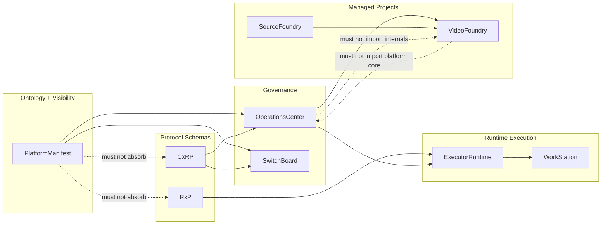

# Visibility Boundary

PlatformManifest owns the allowed visibility model. Custodian detects
violations of that model. OperationsCenter consumes validated manifests.

This separation keeps policy, detection, and orchestration from collapsing
into one component.

## Boundary Split

| Component | Owns | Does not own |
| --- | --- | --- |
| PlatformManifest | Entity ontology, topology, visibility policy, projection rules. | CxRP/RxP contract schemas, runtime execution. |
| Custodian | Leak detection, hygiene checks, invariant detection, policy validation results. | The ontology itself or orchestration policy. |
| OperationsCenter | Governance, validation, orchestration, enforcement workflow. | PlatformManifest ontology or Custodian detector internals. |
| ExecutorRuntime | Runtime invocation driver for OperationsCenter. | Deployment hosting and visibility policy. |
| WorkStation | Deployment and hosting layer. | OC execution backend ownership. |

## Custodian Checks

Custodian can validate PlatformManifest outputs and generated public
artifacts against declared visibility policy:

* Does a public manifest leak private repo names?
* Does a public manifest expose private URLs?
* Does a public artifact reference internal paths?
* Does a README contain private topology terms?
* Does a generated manifest expose private bindings?
* Does a public schema reference a private-only schema URI?
* Does a public repo include private deployment details?
* Does a public relationship edge violate projection policy?

The expected enforcement path is:

1. PlatformManifest declares visibility policy and projection rules.
2. Projection generates public output from private/superset input.
3. Custodian scans generated output.
4. Violations fail build, release, or publication.
5. OperationsCenter consumes only validated manifest data.

## Detector Input

PlatformManifest exposes the policy descriptor through code and CLI:

```bash
platform-manifest custodian-policy
```

The descriptor contains:

* `policy_owner: PlatformManifest`
* `policy: public_private_projection`
* `unknown_visibility: private`
* `unknown_field_policy: drop`
* `forbidden_public_fields`
* stable Custodian `check_id` values for the checks above

Custodian can ingest this descriptor as detector input while retaining
ownership of detector implementation and reporting.

The Custodian integration implements PMV detectors:

* `PMV1` validates generated public manifests for forbidden public fields,
  private-looking URLs, internal paths, and configured private terms.
* `PMV2` validates that public relationship edges point only to public nodes
  declared in the public manifest.

These detectors are owned by PlatformManifest and exported through the
Custodian-native contributor target
`platform_manifest.custodian_native:build_custodian_detectors`. They consume
generated PlatformManifest projection artifacts; they do not redefine
PlatformManifest ontology or projection policy.

## Boundary Diagram



## Static Check Plan

Until full projection code lands, the repository should retain static checks
that verify the architecture docs keep the boundary visible. Those checks
should assert:

* Required invariant statements remain present.
* All five Mermaid diagrams remain present.
* Docs continue to state that PlatformManifest references CxRP and RxP
  rather than owning their schemas.
* Docs continue to describe VideoFoundry as a separate managed project and
  reference testbed.
* Docs continue to describe WorkStation as deployment/hosting and
  ExecutorRuntime as the runtime backend/driver.

When projection implementation lands, add executable projection fixtures to
prove public manifests cannot contain private-only fields, private-only
edges, private schema URIs, internal paths, or private repo names.
